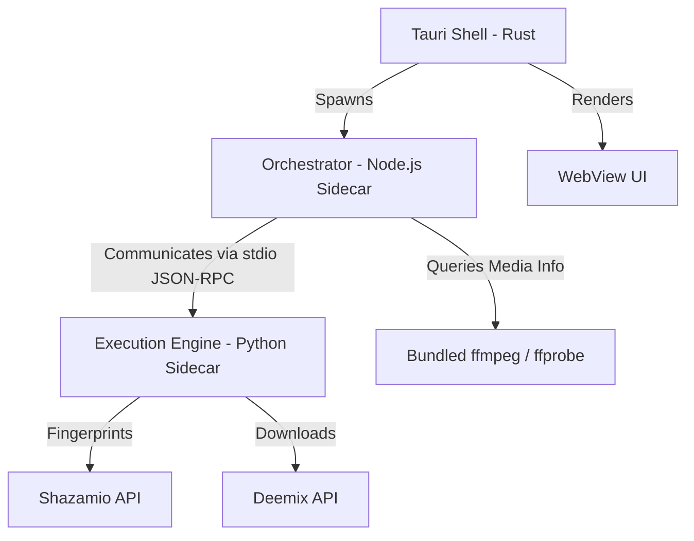

# CrateUp

CrateUp is a premium, offline-first desktop application designed for professional DJs to audit, parse, fingerprint, and upgrade music libraries. It automates the process of identifying low-quality tracks in a music library, matches them against high-quality catalog items, downloads replacements, and commits upgrades while preserving metadata and playlist structures (like Rekordbox).

## Key Features & Workflows
- **Rekordbox XML Integration**: Import exported playlists or folder collections from Rekordbox to process matching audio files and preserve loops, hot cues, beat grids, and location references.
- **Automated Audio Fingerprinting**: Analyzes tracks using Shazam's audio recognition engine to resolve artist, title, and public catalog identifiers.
- **Lossless Upgrades**: Fetches pristine quality replacements (such as FLAC or high-bitrate audio formats) from Deezer utilizing a robust rate-limited download queue.
- **Verification UI**: Features an intuitive side-by-side comparison screen using WaveSurfer.js players, allowing DJs to manually audit and compare original/staged audio files before committing changes.
- **Non-Destructive File Commit**: Safeguards library integrity by performing safe copy actions to a user-specified output folder, keeping original library files untouched, and outputting an updated Rekordbox XML with redirected path locations.

---

## Technical Architecture

CrateUp utilizes a high-performance, multi-layered "nesting doll" architecture to coordinate backend system operations with a reactive frontend:



- **Desktop Shell Framework (Tauri v2 + Rust)**: Manages native window lifecycles, filesystems, and secure system bridging contexts.
- **Orchestration Layer (Node.js Sidecar)**: Coordinates scanning traversals, schedules throttle queues, manages progress ledger updates (`.crateup-progress.json`), and handles the final file copying/committing logic.
- **Execution Engine (Python Sidecar)**: Executes asynchronous commands via stdio JSON-RPC, wrapping the `shazamio` library for fingerprinting and the `deemix` core for catalog extraction.
- **Media Decoders**: Bundles static `ffmpeg` and `ffprobe` binaries. They are programmatically mapped and symlinked at runtime under the OS temporary directory block to prevent system-wide executable path conflicts.
- **Frontend UI Framework**: Built using CSS and Tailwind CSS, featuring WaveSurfer.js v7 canvas rendering to parse and display waveforms locally using custom asset protocol bindings.

---

## Security & Offline-First Compliance

CrateUp is designed to operate securely in festival booths, club environments, or locations with restricted internet access:
- **Strict Content Security Policy (CSP)**: Built with an explicit production CSP string that disables unsafe external CDN connections, restricting script/style execution solely to local bundles.
- **Zero External CDNs**: All assets (including typography fonts and utility libraries like WaveSurfer.js) are completely localized within the application structure.
- **Strict Local Asset Scopes**: Restricts file reading and waveform stream requests strictly to safe custom protocol paths.

---

## Local Development Setup

Ensure you have Node.js and Python 3.11+ installed.

1. **Clone the repository and install dependencies**:
   ```bash
   npm install
   ```

2. **Run in hot-reloading development mode**:
   ```bash
   npm run tauri dev
   ```

---

## Production Packaging

To compile release binaries and package standalone macOS `.app` and `.dmg` bundles:
```bash
npm run tauri build
```
